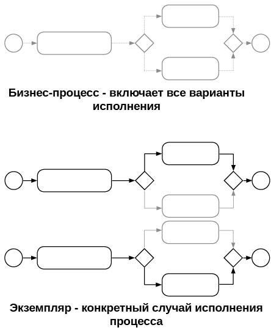

# 2 урок:  Понятие бизнес-процесса и экзепляра процесса

Понятие бизнес-процесса очень широкое, существует масса трактовок. Чтобы эту рассылку вы понимали правильно, вам нужно знать что под процессами понимает международное сообщество.

## Официальное определение (ABPMP.ORG)

Существует общественная организация — The Association of Business Process Management Professionals. Она создана в 2003 году, в США.  
Задача организации — обобщать опыт экспертов в области процессов, проводить обучение, издавать книги и глоссарии.
Ассоциация не зависит от производителей софта или методологии и существует полностью на взносы членов, поэтому я ей доверяю.
Коллеги из ABPMP написали свод знаний по управлению процессами. В нём подробно описан термин “процесс”.  

## Перевод определения на русский язык без изменений с комментариями

||||
|--- |--- |--- |
|**Официально**|**По-человечески**|**И в чём польза определения?**|
|Набор функций, выполняемых в определённой последовательности для создания потребительской ценности.|Последовательность работ.|Не процесс, если нет ценности для потребителей или последовательность не определена.|
|Процесс начинается с чётко определенных внешних событий.|Процесс начинается с внешних событий.|Процессы не начинаются случайно.|
|Процесс — сочетание всех действий, требуемых для достижения цели, получения результата, продукции или услуги, вне зависимости от того, где они выполняются.|Процесс включает всё необходимое для получения результата.|В процесс всегда должна включаться вся работа, чтобы достигнуть цели. Процесс не может окончиться безрезультатно.|
|Такое объединение действий, выполняемых совместно для создания продукции или услуги, обычно выходит за рамки функциональных границ и границ организации.|Обычно в процессе задействованы несколько отделов или организаций.|Если в вашем процессе один человек(или отдел, роль), то это повод всё перепроверить.|
|Действия, показанные в контексте их взаимосвязей, образуют последовательность или поток.|—|—|
|В таком контексте определяется набор действий, выполняемых людьми, системами или совместно теми и другими для достижения одной или нескольких целей|В процессе могут участвовать люди и программы.|На схемах процессов надо рисовать задачи для программ, если программы делают работу для результата процесса.|
|Процессы запускаются определёнными событиями и порождают определённый результат (или несколько результатов) в виде завершения процесса или передачи ответственности другому процессу|Результатом работы процесса является его завершение или запуск\изменение другого процесса.|Процессы должны иметь возможность завершаться. Процессы можно соединять с другими процессами.|
|Процессы состоят из набора взаимосвязанных задач или действий, нацеленных на решение конкретной проблемы|—|—|
|В контексте управления бизнес-процессами «бизнес-процесс» определяется, как сквозная работа, создающая потребительскую ценность|—|—|
|Понятие сквозной работы является принципиальным. В нём подразумевается вся работа, необходимая для создания потребительской ценности в полном объёме, невзирая на функциональные границы|В BPM “сквозная работа” является принципиальной. Процесс должен быть полезен потребителю, несмотря на то, кто делает работу для получения пользы.|“Сквозная” работа — это та, которая пришла из внешнего мира (“Хочу доставку воды!”, запрос клиента”) и в него же (“Вот вода, вот акты, подписывайте!”) пройдя через вашу организацию(Записи в CRM, отгрузки, оплаты). BPM — это о процессах, а не про служебки на ремонт мышки в ИТ-отдел.|

## Что такое экземпляр процесса

Представьте, что у вас есть чертеж холодильника, который включает в себя 2 модели: с одной и двумя ручками. Чертеж будет называться бизнес-процессом, а конкретный холодильник (с одной или двумя ручками) — экземпляром процесса.  

