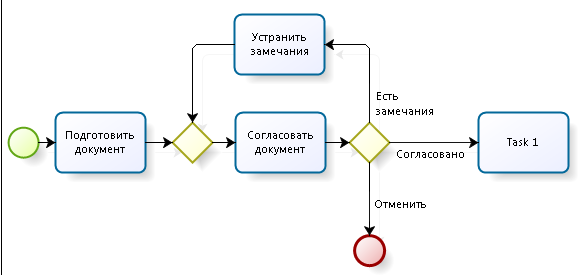
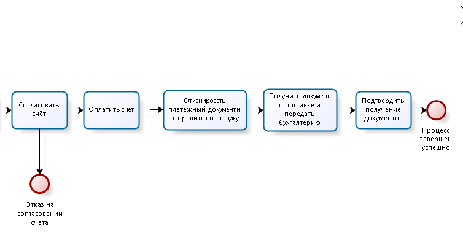
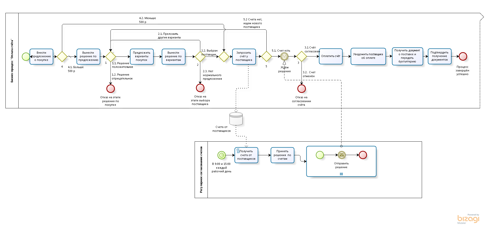

# 9 урок: Разбираем и улучшаем схему BPMN
Сегодня посмотрим на живом примере, как улучшать диаграммы BPMN и как мыслить в процессной концепции.  Я взял BPMN-диаграмму с прошлых проектов, составленную аналитиком-стажёром.

В этом письме описаны размышления, которые рождаются в голове согласующего. Замечания бывают как идеологические («Что ты хотел сказать этой схемой?»), так и технические («Так работать не будет!»).

## Упрощения в схемах

Мы намеренно не используем в схемах дорожки для отображения ответственных, потому что это усложняет читаемость схемы. 

Мы не указываем потоки работ для редактирования и уточнения, хотя в реальности они всегда есть.

  

  

Мы так делаем потому что:

- схемы будут большие;
- смысла не прибавляется;
- в BPMS этот паттерн реализуется быстрее, чем описывается и согласовывается в ТЗ.
- Если показать этот цикл важно для согласования конкретной схемы — делаем это.

## Бизнес-процесс «Согласование счёта»

Самый частый случай из обслуживающих процессов — оплата счёта. Кто-то в интересах компании хочет что-то купить. Начинается такой процесс с подачи потребности, а заканчивается либо отказом, либо полученными документами в бухгалтерии.

Давайте посмотрим, что принёс начинающий аналитик:  
  

### Что хорошего в этой схеме
В целом, из схемы понятно, что хотел сказать автор — инициативу по закупке может подавать любой сотрудник, она обязательно проходит согласование с генеральным директором, который должен выбрать с каким поставщиком работать. 

После этого получаем счёт от него, еще раз согласовываем счёт, и получаем закрывающие документы в бухгалтерию.

Еще хорошо:

- счастливый путь понятен;
- наименование задач в формате «Глагол» + «Существительное».

### Что плохого в этой схеме

- использовать Milestone (прерывистые линии и надписи сверху) для обозначения ролей, выполняющих задачи нельзя — это дополнительная «фишка» Bizagi, такой штуки в BPMN2.0 нет;
- шумно — много линий, создается впечатление чего-то запутанного, хотя процесс описан просто;
- один выход — не получится анализировать чем заканчиваются процессы;
- шлюзы и стрелки не названы;
- какая-то ерунда с задачей «Вынести решение по вариантам»  — 2 входа в задачу, 2 выхода.  Можно поймать ошибку с токенами.

### Улучшим внешний вид
     
Убрали Milestones, уменьшили расстояние между задачами. Уже лучше, но всё равно не то.

### Добавим нормальные завершающие события
Добавим нормальные завершающие события и назовём их — в будущем сможем строить аналитику по этим событиям, т.е. понимать чем завершались процессы.  
  
  

### Избавляемся от двух входов и двух выходов в задачу

Хотя BPMS-движки нормально обрабатывают большое количество входов и выходов в задаче, на схемах я так делать не люблю — сложно модифицировать в будущем (представьте, в задаче будет не 2 выхода, а 15 — целая куча стрелочек будет) и теряется логика принятия решения перехода по потоку.

  

По оформлению и хорошему стилю всё. Подумаем над логикой процесса.

## Вопросы к аналитику и бизнесу

Самый главный вопрос — правда, что генеральный директор согласовывает счета и предложения по покупке по одному запросу? А если счетов 50 штук в день?
В оплате счетов генеральные директора, финансовые службы, бухгалтерия оплачивают и согласовывают счета пачками.

Еще небольшие вопросы:

- что будет с процессом, если поставщик не прислал счёт? На внешних участников мы воздействовать не можем, можем только реагировать. А сейчас процесс в любом случае требуется получения счёта;
- платёжка — это сразу электронный документ. Странно что его нужно сканировать, да и еще делает этот тот же самый человек, что и отправляет поставщику;
- странно, что любой сотрудник может подать запрос и он не согласовывается с руководителем инициатора;
- странно, что нет согласований и сравнений с бюджетами. Неужели я могу в середине месяца подать запрос на 1.5 млн.рублей?
- что произойдет, если потребность одинаковая, например купить ручки. Будет 2 счета на 100 рублей, или соберём один на 200 и пустим на согласование?
- как быть с регулярными платежами? Они будут запускаться по этому процессу или будут оплачиваться как-то иначе?
- как быть, если потребность на небольшую сумму, рублей на 500? Прогонять весь процесс может быть дорого;
- обязательно ли всем поставщикам отправлять платёжку? А если она кому-то не нужна?

Нагруженный этими вопросами начинающий аналитик начинает думать, вырабатывает решения и идет к клиенту их согласовывать.

### Ответы аналитика и бизнеса

Аналитик провёл совещание с клиентом и принёс ответы на вопросы:

|||
|--- |--- |
|Правда по одному счёту согласуете?|Нет, согласуем скопом в 9 утра и в 15 дня|
|Что будет с процессом, если поставщик не прислал счёт?|Нужно искать нового поставщика|
|Платёжка — это сразу электронный документ|Да, пусть бухгалтер её прикрепляет|
|Странно, что любой сотрудник может подать запрос и он не согласовывается с руководителем инициатора.|У нас мало сотрудников, всё согласует генеральный директор|
|Странно, что нет согласований и сравнений с бюджетами. Неужели я могу в середине месяца подать запрос на 1.5 млн.рублей?|Подать можете, но она будет отклонена. Бюджеты подразделений есть в 1С, но давайте пока их не трогать. Потом прикрутим проверку|
|Что произойдет, если потребность одинаковая, например купить ручки. Будет 2 счета на 100 рублей, или соберём один на 200 и пустим на согласование?|Потребности собирать будем в другом процессе, для этого процесса считаем что потребность уже сформулирована и собрана|
|Как быть с регулярными платежами? Они будут запускаться по этому процессу или будут оплачиваться как-то иначе?|Регулярные платежи идут через 1С, там не требуется согласований|

## Что меняем в схеме
Генеральный директор не хочет согласовывать счета по одному — и он прав, у него полно другой полезной работы.

Изменения:

- поставщиков и варианты покупки ГД согласует по одиночке, а счета оплачивает скопом;
- добавим шлюз после запроса к поставщику счёта;
- изменим формулировку задачи с платёжкой;
- добавим развилку, если сумма счёта небольшая;
- изменим формулировку о платёжке.

  

## Совершенство бесконечно

Дальше мы задумаемся над тем, что поставщик-то может и не поставить товар! И может не предоставить документы, и с этим нужно что-то делать. Ещё понимаем, что не обработан случай, когда счетов на согласование нет.

Продолжать можно бесконечно, чтобы остановиться надо помнить вашу цель — автоматизировать бизнес-процесс для чего-то. В BPMS системах полно инструментария, чтобы снять некорректные процессы, уточнить информацию комментариями и так далее.

Главное помнить, что схемы настоящих процессов — сложные. Если схема простая, из 4 квадратиков — то это повод задуматься и понять, что такую схему автоматизировать не нужно.

## Факультатив

<iframe width="560" height="315" src="https://www.youtube.com/embed/3R3N1Cof9IQ?si=ZO3D7ow_kxR5-NcG" title="YouTube video player" frameborder="0" allow="accelerometer; autoplay; clipboard-write; encrypted-media; gyroscope; picture-in-picture; web-share" referrerpolicy="strict-origin-when-cross-origin" allowfullscreen></iframe>

<iframe width="560" height="315" src="https://www.youtube.com/embed/cTj_hXN6ac0?si=oDZvQKUQl4iTuHS8" title="YouTube video player" frameborder="0" allow="accelerometer; autoplay; clipboard-write; encrypted-media; gyroscope; picture-in-picture; web-share" referrerpolicy="strict-origin-when-cross-origin" allowfullscreen></iframe>